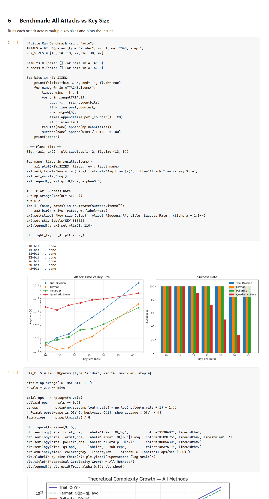

# Discrete Mathematics — Laboratories

[](LICENSE)
[](#license)

Solutions for the **Discrete Mathematics** laboratory series (Master's level, PWR).
Each lab takes one pillar of discrete maths and turns it into something you can *run* —
a solver, a notebook, a tested library, an interactive explorer, a web app, a graph
database. This page is the guided tour; every lab also has its own README with the
details and how-to-run.

> **New here?** Read this page top to bottom — it walks the six labs as one story, from
> optimisation and cryptography, through set theory and complexity, to graphs and a
> knowledge graph in Neo4j. Then open any lab folder for the deep dive.

---

## The arc at a glance

| # | Lab | The big idea | Built with |
|---|-----|--------------|-----------|
| 1 | [Max-Cut](lab1_Max_Cut/) | NP-hard optimisation by a **multi-start local-search heuristic** | Python |
| 2 | [Cryptography](lab2_Crypt/) | **RSA** and the classical **factorization attacks** that break weak keys | Jupyter · NumPy |
| 3 | [Sets](lab3_Sets/) | **Set theory** as a tested library — and a set-similarity **recommender** | Python |
| 4 | [Complexity](lab4_Complexity/) | **Growth & computability**: Ackermann, Stirling, Nim | Python (matplotlib · tkinter) + web |
| 5 | [Graph Theory](lab5_GraphTheory/) | Core **graph algorithms** on realistic networks, interactively | HTML · JS · React |
| 6 | [Neo4j](lab6_Neo4j/) | A **Pawlak information system** as a property graph in **Neo4j** | Cypher + offline viewer |

The thread running through all six: take a formal object (a cut, a modulus, a set, a
recursion, a graph, an information system) and make its behaviour **observable**.

---

## Lab 1 — Cutting a graph in half (Max-Cut by local search)

The series opens with a hard problem made practical. **Maximum Cut** — partition a
graph's vertices into two sides so the crossing-edge weight is maximised — is **NP-hard**;
the bundled instance has `2¹²⁷` possible partitions. Instead of an exact search, Lab 1
uses a **local-search heuristic with multi-start**: greedily move the best-improving
vertex to a local optimum, restart from 10 random partitions, keep the best cut. It
trades the guarantee of optimality for a fast, high-quality answer — the everyday bargain
of combinatorial optimisation.


```powershell
cd lab1_Max_Cut && python max_cut_solver.py
```

→ details in **[lab1_Max_Cut/README.md](lab1_Max_Cut/README.md)**

---

## Lab 2 — Breaking RSA when the keys are weak

From optimisation to **cryptography**. Lab 2 builds **RSA** end to end — Miller–Rabin
primality, key generation, modular-exponentiation encrypt/decrypt — then turns attacker
and factors the modulus with four classical methods: **trial division**, **Fermat**,
**Pollard's ρ** and a simplified **Quadratic Sieve**. The payoff is empirical: benchmark
each attack against key size, watch the success rate collapse as the modulus grows, and
extrapolate to why 1024/2048-bit RSA is safe. Security as a *measured* property, not an
assertion.



```powershell
cd lab2_Crypt && jupyter notebook Crypto_Lab2.ipynb   # Run All
```

→ details in **[lab2_Crypt/README.md](lab2_Crypt/README.md)**

---

## Lab 3 — Set theory you can run (and a recommender on top)

Back to foundations. Lab 3 implements **set theory** as a small, **unit-tested** Python
library — `Set`, `MultiSet`, `EmptySet`; union, intersection, complements, Cartesian
product, power set; a propositional-logic parser; and **characteristic functions** with
the identities that tie them to the operations. Then the optional task proves the point
that abstract structure earns its keep: a **job recommender** that ranks candidates by
**Jaccard / Sørensen–Dice / cosine** similarity of skill sets.


```powershell
cd lab3_Sets\mandatory_tasks && python main.py        # framework demo
cd ..\optional_task && python job_recommender_demo.py # the recommender
```

→ details in **[lab3_Sets/README.md](lab3_Sets/README.md)**

---

## Lab 4 — How fast things grow (Ackermann, Stirling, Nim)

Lab 4 is about **growth and complexity**, told through three classics. **Ackermann** is a
total computable function that is *not* primitive recursive — it outruns every bounded
loop, and its inverse `α(n) ≤ 4` is why Union–Find is "almost linear." **Stirling's
approximation** tames the factorial and underpins the `Θ(n log n)` sorting bound. **Nim**
is a game solved completely by parity — the **Sprague–Grundy** XOR rule. Each ships as an
interactive Python explorer (matplotlib dashboards; a tkinter game) and again as a
zero-build **web demo**.


```powershell
cd lab4_Complexity\part1\Ackermann_Function && python ackermann.py
cd ..\nim_game && python main.py                     # the tkinter game
start "lab4_Complexity\part2\DiscreteMath Lab4\index.html"   # the web demo
```

→ details in **[lab4_Complexity/README.md](lab4_Complexity/README.md)**

---

## Lab 5 — Graphs that run (two interactive network studies)

Now the algorithms of **graph theory**, applied to realistic infrastructure and made
interactive in the browser. **SentinelNet** models an Iberian environmental-monitoring
grid; **Q-HYDRO Wrocław** a Lower-Silesia sensing network. Between them they exercise
**BFS/DFS**, **Dijkstra / Bellman–Ford / A***, **minimum spanning trees**, **bridges and
articulation points** (resilience) and a **TSP** tour — each tied to a real question:
what's reachable, the cheapest backbone, what breaks the network. Both are static apps
that run offline.


```powershell
start "lab5_GraphTheory\SentinelNet\SentinelNet.html"
start "lab5_GraphTheory\Q-HYDRO Wrocław\Q-HYDRO Wrocław.html"
```

> SentinelNet was refactored to run **fully offline** — React is vendored locally and the
> JSX is precompiled, so it no longer needs a CDN or a live internet connection.

→ details in **[lab5_GraphTheory/README.md](lab5_GraphTheory/README.md)**

---

## Lab 6 — Knowledge as a graph (a Pawlak information system in Neo4j)

The series closes by moving from algorithms *on* graphs to storing knowledge *as* a
graph. Lab 6 models a **Pawlak information system** `S = (U, A)` — the formal basis of
**rough-set theory** — as a **bipartite property graph** in **Neo4j**: **39** objects
(countries) and **25** attributes joined by **975** `HAS_VALUE` edges, plus an optional
**object-group hierarchy** (rating grade → class) built with **Cypher**. The `.cypher`
scripts are the authoritative deliverable; a self-contained **offline viewer** reproduces
the same graph and every report query (schema, counts, an object's star, selection by
condition, the hierarchy) so you can explore it without installing anything.


```powershell
start "lab6_Neo4j\viewer\index.html"   # the offline viewer
# or run import.cypher + queries.cypher in Neo4j Desktop (see lab6_Neo4j/guide.txt)
```

→ details in **[lab6_Neo4j/README.md](lab6_Neo4j/README.md)**

---

## Running everything

| Stack | You need |
|-------|----------|
| Labs 1, 3, 4 (Part 1) | **Python 3**; `matplotlib` for the Lab 4 plots (tkinter ships with Python) |
| Lab 2 | **Jupyter** + NumPy/Matplotlib (or open the notebook in Google Colab) |
| Labs 4 (Part 2), 5, 6 (viewer) | any modern **browser** — all run offline, no build step |
| Lab 6 (full) | **Neo4j Desktop** for the authoritative Cypher build |

Each lab folder is self-contained and carries its own README with the exact commands,
inputs and expected output.

---

## License

Released under the [MIT License](LICENSE) — open source and free to use. You may use, copy,
modify, and redistribute everything in this repository for any purpose, including commercially;
the only condition is to keep the copyright and license notice.
