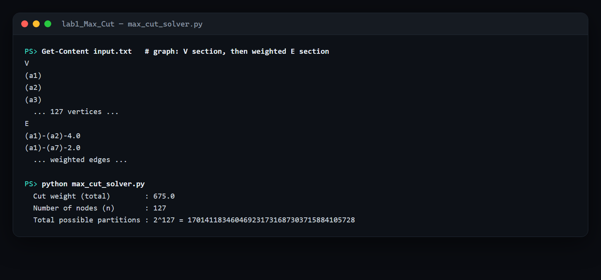

# Lab 1 — Maximum Cut via multi-start local search

> **Aim:** approximate the **Maximum Cut** of a weighted graph with a **local-search
> heuristic**, restarted from many random partitions — trading the exponential cost of
> an exact search for a fast, high-quality answer.

**Max-Cut** asks you to split a graph's vertices into two sets so that the total weight
of the edges *crossing* between them is as large as possible. It is **NP-hard**, so on
anything but tiny graphs an exact search over all `2ⁿ` partitions is hopeless — for the
bundled instance that is `2¹²⁷`, more partitions than there are atoms in the observable
universe.

## The algorithm

1. **Random start** — assign every vertex to set A or B at random.
2. **Gain** — for each vertex, compute how much the cut would improve if it switched sides.
3. **Local move** — move the best-improving vertex; repeat while any move helps (a local optimum).
4. **Multi-start** — do this 10 times from different random seeds.
5. **Keep the best** cut found across all restarts.

Random restarts are what lift a purely greedy local search out of bad local optima and
make the heuristic robust.

## Run

```powershell
cd lab1_Max_Cut
python max_cut_solver.py
```

The graph is read from [`input.txt`](input.txt): a `V` section listing vertices `(name)`
and an `E` section of weighted edges `(u)-(v)-weight`. The solver reports the cut weight,
the vertex count, and the size of the search space it avoided:



No dependencies beyond the Python standard library.

See the [root README](../README.md#lab-1--cutting-a-graph-in-half-max-cut-by-local-search) for context.
