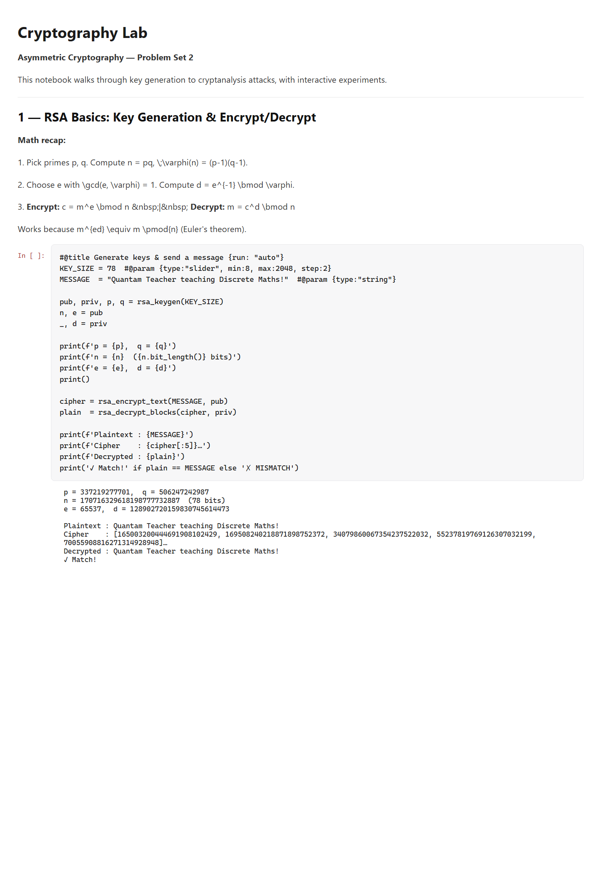

# Lab 2 — Asymmetric cryptography (RSA) and classical attacks

> **Aim:** build a working **RSA** pipeline end to end — key generation, encryption,
> decryption — and then *break* weak keys with the classical **integer-factorization
> attacks**, measuring empirically how quickly each one fails as the key grows.

Everything lives in one runnable notebook: [`Crypto_Lab2.ipynb`](Crypto_Lab2.ipynb).

## What it covers

1. **Number-theory core** — Miller–Rabin primality test, prime generation, the extended
   Euclidean algorithm and the modular inverse.
2. **RSA** — key-pair generation from two primes, then encrypt/decrypt of a text message
   by modular exponentiation.
3. **Four factorization attacks** on the modulus `n = p·q`:
   - **Trial division** — every factor up to `√n`.
   - **Fermat** — writes `n = a² − b²`; deadly when `p` and `q` are close.
   - **Pollard's ρ** — a pseudo-random walk with cycle detection.
   - **Quadratic Sieve** (simplified) — the smooth-number / congruence-of-squares idea.
4. **Experiments** — attack runtime vs. key size, success rate over repeated trials,
   sensitivity to the prime gap `|p − q|`, a theoretical-complexity comparison, and an
   extrapolation to why 1024/2048-bit RSA is safe.

## Run

Open the notebook in Jupyter (or upload it to Google Colab — the `#@title` / `#@param`
cells are Colab form controls, but the code runs unchanged in plain Jupyter):

```powershell
cd lab2_Crypt
pip install jupyter numpy matplotlib
jupyter notebook Crypto_Lab2.ipynb    # then Run All
```

### RSA in action — keygen, encrypt, round-trip



### The attacks, benchmarked against key size

Each attack is timed across growing key sizes, with success rates and a theoretical
complexity comparison:


## The takeaway

RSA's security rests entirely on the hardness of factoring large semiprimes. For toy
key sizes the attacks recover the factors in milliseconds; as the modulus grows the cost
explodes, and properly generated modern keys are infeasible to break by these classical
methods — which is exactly why key size and a large prime gap matter.

See the [root README](../README.md#lab-2--breaking-rsa-when-the-keys-are-weak) for context.
