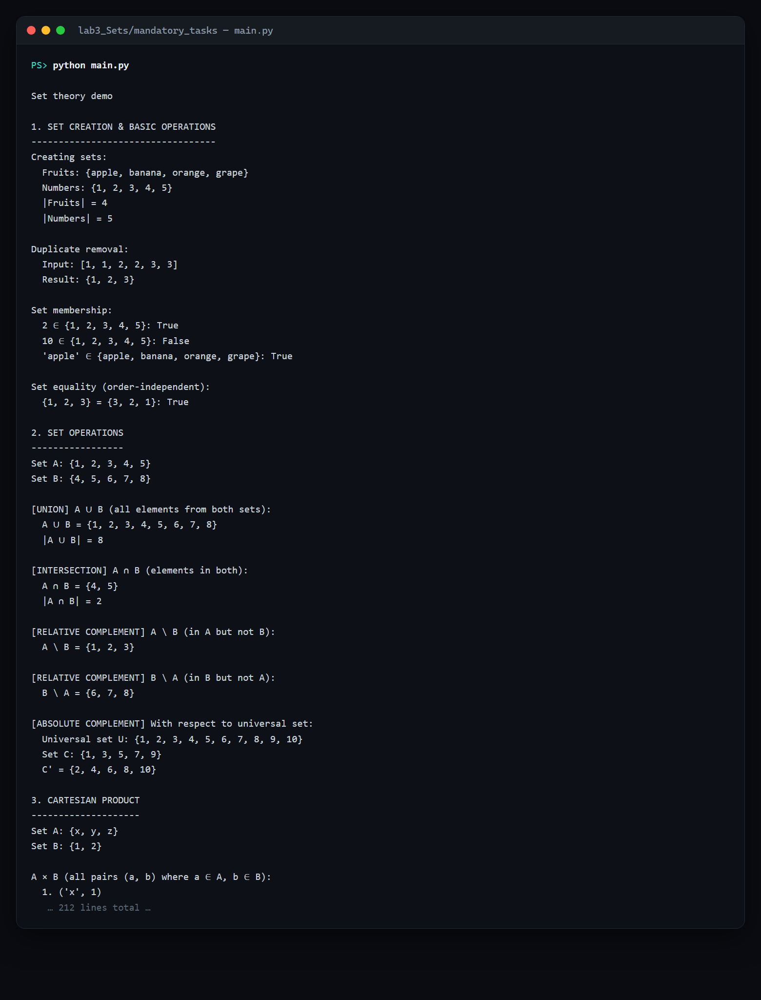
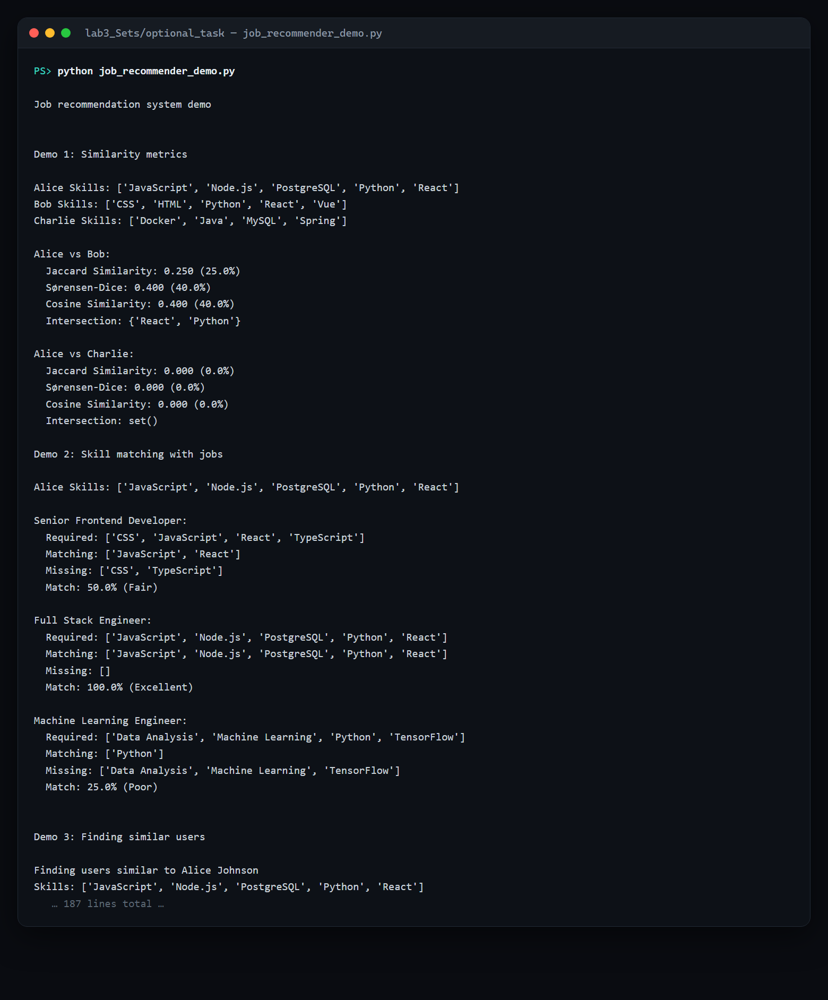

# Lab 3 — Set theory, from first principles to a recommender

> **Aim:** turn the formal machinery of **set theory** into a small, tested Python
> framework — sets, multisets, operations, logic, characteristic functions — and then
> show it pays off by driving a **set-similarity job recommender**.

The lab is in two parts, each with its own detailed README.

## Part 1 — the framework (mandatory) · [`mandatory_tasks/`](mandatory_tasks/)

A from-scratch library modelling:

- **Core types** — `Set`, `MultiSet`, `EmptySet`.
- **Operations** — union, intersection, relative & absolute complement, Cartesian
  product, power set, cardinality and the inclusion–exclusion principle.
- **Logic** — a propositional-formula parser and truth-table generator.
- **Characteristic functions** — membership functions for sets and multisets, and the
  identities that connect them to the set operations (e.g. `χ_(A′) = 1 − χ_A`).
- **Tests & demos** — `test_suite.py`, a `main.py` walk-through and worked `examples.py`.

```powershell
cd lab3_Sets\mandatory_tasks
python main.py          # the guided demo
python test_suite.py    # the tests
```



## Part 2 — the job recommender (optional) · [`optional_task/`](optional_task/)

Set similarity applied to matching people to jobs by their skill sets:

- **Metrics** — Jaccard, Sørensen–Dice and cosine similarity between skill sets.
- **Skill-match analysis** — matching vs. missing skills per candidate/role.
- **Ranked recommendations** across several users and metrics.

```powershell
cd lab3_Sets\optional_task
python job_recommender_demo.py
```



> **Windows note.** The demos print set-theory glyphs (`∈`, `∪`, `χ`, `Σ`, …). The entry
> scripts now force UTF-8 output, so they run cleanly even in a `cp1252` console (which
> would otherwise raise a `UnicodeEncodeError`).

## The takeaway

The mandatory part builds confidence with the formal operations; the optional recommender
shows the same set operations turning directly into a practical ranking task — theory and
application, one framework.

See the [root README](../README.md#lab-3--set-theory-you-can-run-and-a-recommender-on-top) for context.
