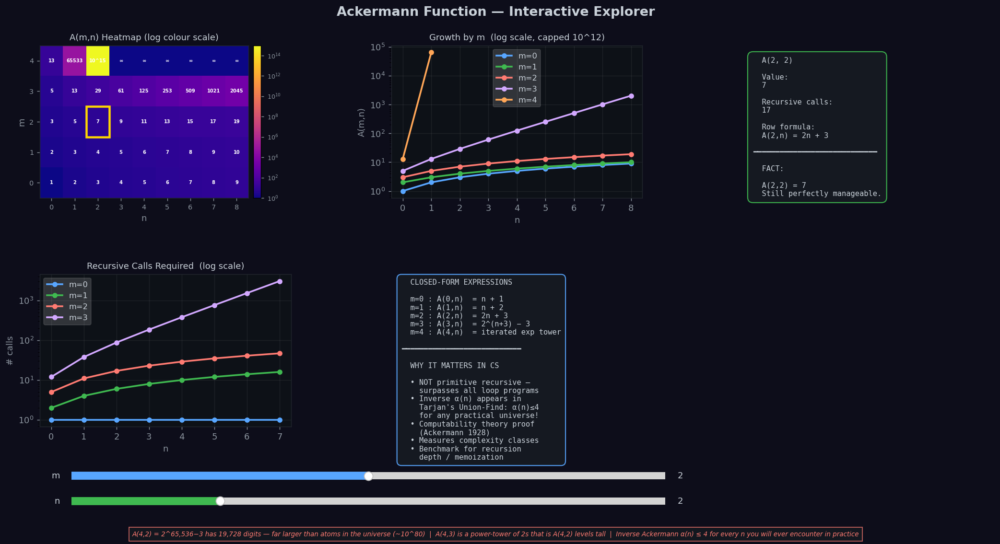
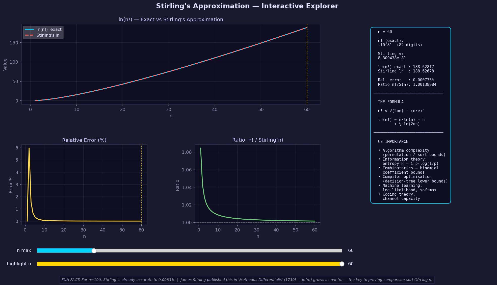
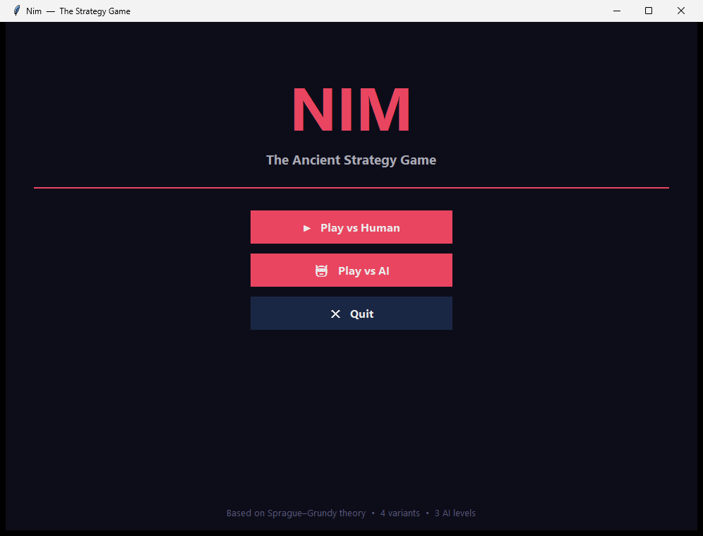
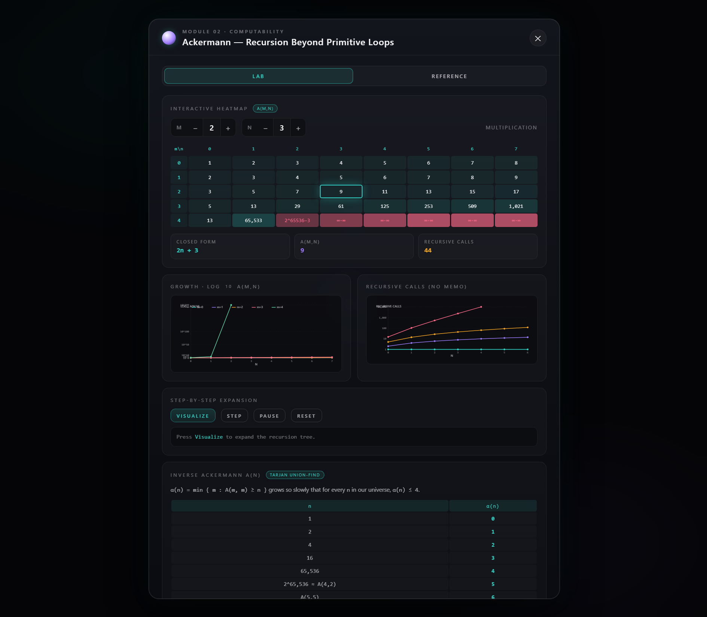

# Lab 4 — Complexity & growth: Ackermann, Stirling, Nim

> **Aim:** make **asymptotic growth and algorithmic complexity** tangible through three
> classic objects — a function that outruns every loop (**Ackermann**), an approximation
> that tames the factorial (**Stirling**), and a game solved by parity (**Nim**) — each
> as an interactive exploration.

The lab has two parts: Python explorers you run locally (**Part 1**) and a browser demo
that mirrors them (**Part 2**).

---

## Part 1 — Python explorers · [`part1/`](part1/)

### Ackermann function · [`Ackermann_Function/`](part1/Ackermann_Function/)

The textbook example of a **total computable function that is not primitive recursive** —
it grows faster than any function you can write with bounded `for`-loops. The explorer
plots the `A(m,n)` heatmap, per-row growth, recursive-call counts, the closed forms for
small `m`, and the inverse `α(n)` (which is `≤ 4` for any input in this universe — the
reason Union–Find is "almost linear").

```powershell
cd lab4_Complexity\part1\Ackermann_Function
python ackermann.py
```



### Stirling's approximation · [`Stirlings_Approximation/`](part1/Stirlings_Approximation/)

`n! ≈ √(2πn)·(n/e)ⁿ`, computed in log space for stability, with the exact-vs-approx
curve, the relative error and the `n!/Stirling(n)` ratio — the tool behind the
`Θ(n log n)` comparison-sort bound.

```powershell
cd lab4_Complexity\part1\Stirlings_Approximation
python stirling.py
```



### Nim · [`nim_game/`](part1/nim_game/)

A full **tkinter GUI** for Nim — four rule variants, three AI difficulty levels, and a
layered screen architecture — where the unbeatable AI plays the **Sprague–Grundy**
strategy (a position is losing ⇔ the XOR of the heap sizes is 0).

```powershell
cd lab4_Complexity\part1\nim_game
python main.py
```



> Ackermann and Stirling use `matplotlib`; Nim uses `tkinter` (bundled with Python).

---

## Part 2 — the web demo · [`part2/DiscreteMath Lab4/`](part2/DiscreteMath%20Lab4/)

A browser bundle that presents the same three topics as an interactive "atom": click an
electron (Stirling / Ackermann / Nim) to open its lab — an `A(m,n)` heatmap and growth
charts, Stirling numbers and factorial error, or a playable Nim board — no build step.

```powershell
cd "lab4_Complexity\part2\DiscreteMath Lab4"
start index.html
```



## The takeaway

Ackermann shows a simple recursion escaping primitive recursion; Stirling shows why an
asymptotic estimate is indispensable in combinatorics; Nim ties game theory to a clean
algorithmic strategy and a UI. Three faces of "how fast does it grow, and what does that
cost."

See the [root README](../README.md#lab-4--how-fast-things-grow-ackermann-stirling-nim) for context.
