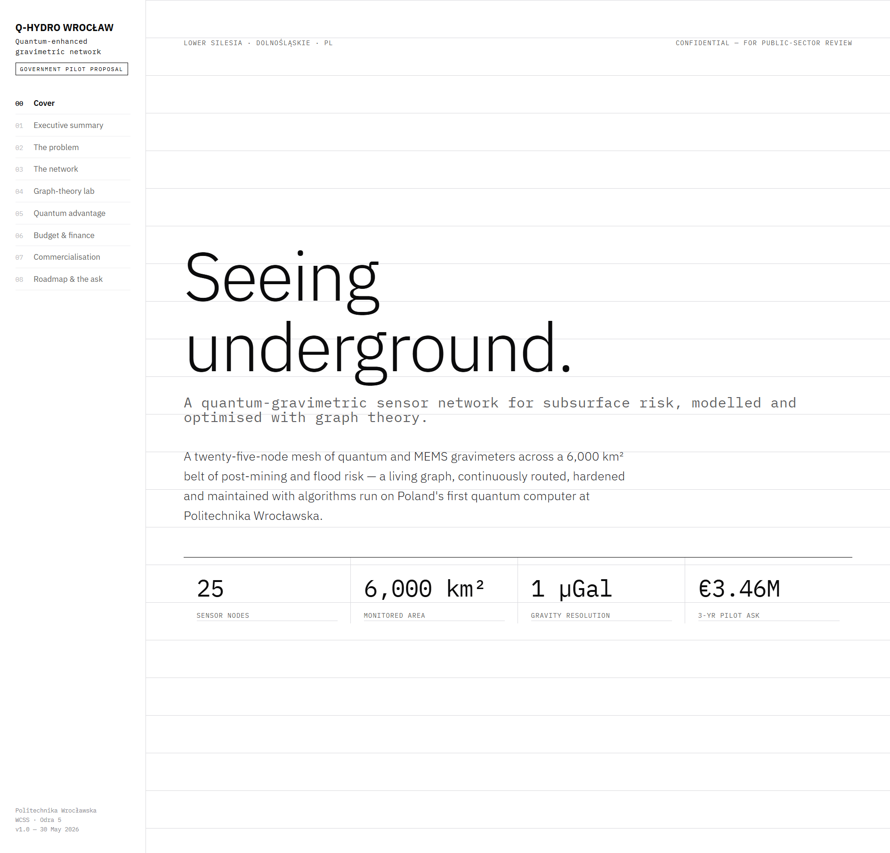

# Lab 5 — Graph Theory: two interactive case studies

> **Aim:** apply the core algorithms of graph theory — traversal, shortest paths,
> connectivity, spanning trees, robustness — to realistic infrastructure networks,
> and make them **interactive** in the browser. Two self-contained web apps, no build
> step, no server: open the HTML and explore.

Both projects model a real-world sensor network as a **weighted graph** and *compute*
their metrics in the page (they don't hard-code answers).

| Project | Scenario | Highlights |
|---------|----------|-----------|
| [**SentinelNet**](SentinelNet/) | an Iberian environmental-monitoring grid | vertices/edges/bridges/cut-vertices, BFS · DFS · Dijkstra · Bellman–Ford · A* · MST · TSP from any node |
| [**Q-HYDRO Wrocław**](Q-HYDRO%20Wrocław/) | a Lower-Silesia quantum-gravimetric sensing network (funding-proposal styling) | 25-node weighted mesh, seven algorithmic lenses, failure/routing exploration |

---

## Run them

Both are static — just open the HTML file (works offline, straight from `file://`):

```powershell
# SentinelNet
start "SentinelNet\SentinelNet.html"

# Q-HYDRO Wrocław
start "Q-HYDRO Wrocław\Q-HYDRO Wrocław.html"
```

### SentinelNet — the graph, on one canvas

Click any node to inspect it, then run an algorithm from it. Live counts for
vertices, edges, **bridges**, **cut vertices** and connected regions.


> **Offline fix.** SentinelNet is a React app written as a single `.jsx` file. It used
> to be loaded through the Babel CDN with `type="text/babel"`, so opening it directly
> (`file://`) left a **blank page** — the browser blocks Babel from fetching the local
> `.jsx`, and there was no internet fallback. It now ships **React vendored locally**
> (`SentinelNet/vendor/`) and a **precompiled `sn-app.js`** (Babel-transpiled from
> `sn-app.jsx`), so it renders instantly offline with no CDN and no runtime Babel. See
> [`SentinelNet/README.md`](SentinelNet/README.md) for the build.

### Q-HYDRO Wrocław — a graph-theory funding proposal

A document-style walk-through (Cover → The network → Graph-theory lab → …) around a
25-node gravimeter mesh, with the graph algorithms as the technical core.



---

## Concepts exercised

Traversal (**BFS / DFS**), single-source shortest paths (**Dijkstra**, **Bellman–Ford**,
**A***), **minimum spanning tree** (Prim / Kruskal), **bridges & articulation points**
(connectivity / resilience), and a **TSP** tour approximation — each tied to a concrete
question about the network (reachability, routing, what breaks it, cheapest backbone).

See the [root README](../README.md#lab-5--graphs-that-run-two-interactive-network-studies) for context.
