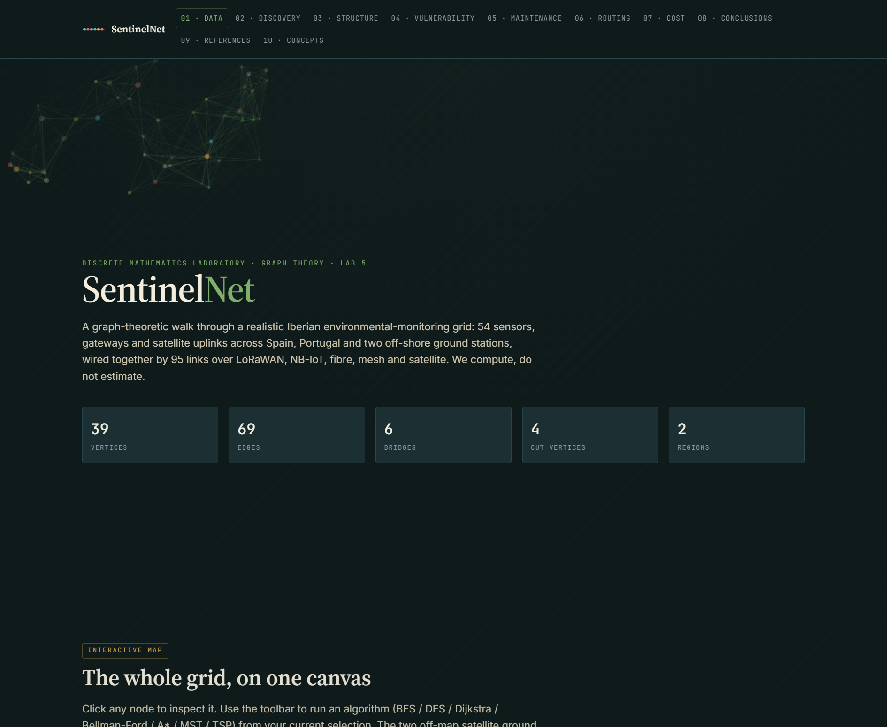

# SentinelNet — graph theory on an environmental-monitoring grid

An interactive, single-page **React** app that treats a realistic **Iberian
environmental-monitoring network** (air-quality stations, gateways, fibre and
satellite uplinks across Spain, Portugal and two off-shore ground stations) as a
**weighted graph**, and runs the classic graph-theory algorithms on it live.



## Run it

**Just double-click `SentinelNet.html`.** It runs fully offline — no server, no
internet, no build step.

The ten sections walk from the data (01) through discovery, structure, vulnerability,
maintenance, routing and cost to conclusions and the concept glossary. Click any node
on the canvas to inspect it, then drive an algorithm from your selection:

- **Traversal** — BFS, DFS
- **Weak spots** — bridges, cut (articulation) vertices
- **Shortest path** — Dijkstra, Bellman–Ford, A*
- **Backbone & tour** — minimum spanning tree, TSP approximation

## How it's built (and the offline fix)

The whole UI is one React component tree written in **`sn-app.jsx`**. Originally the
page pulled React and `@babel/standalone` from a CDN and transformed the JSX in the
browser (`<script type="text/babel" src="sn-app.jsx">`). That has two failure modes:
it needs the internet, and — more importantly — opening the file directly (`file://`)
shows a **blank page**, because the browser won't let Babel `fetch()` the local `.jsx`.

The fix makes it self-contained:

```
vendor/react.production.min.js       ← React, vendored locally
vendor/react-dom.production.min.js
sn-app.js                            ← precompiled from sn-app.jsx (Babel preset-react)
SentinelNet.html                     ← loads the two vendor scripts + sn-app.js (plain <script>)
```

`sn-app.jsx` remains the **source of truth**. To rebuild `sn-app.js` after editing it,
transpile the JSX (any Babel with `preset-react`), e.g.:

```bash
npx babel sn-app.jsx --presets @babel/preset-react -o sn-app.js
```

## Files

```
SentinelNet/
├─ SentinelNet.html   page shell (loads vendor React + data + algorithms + app)
├─ sn-data.js         the graph: nodes, edges, coordinates, types, references
├─ sn-concepts.js     the concept glossary (definitions)
├─ sn-algo.js         graph algorithms (BFS/DFS/Dijkstra/Bellman–Ford/A*/MST/TSP, bridges, cut vertices)
├─ sn-app.jsx         the React UI — SOURCE (edit this)
├─ sn-app.js          GENERATED from sn-app.jsx (do not edit by hand)
├─ styles.css         presentation
└─ vendor/            React + ReactDOM (production UMD), vendored for offline use
```
