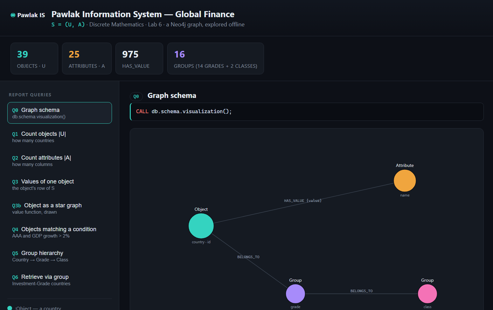
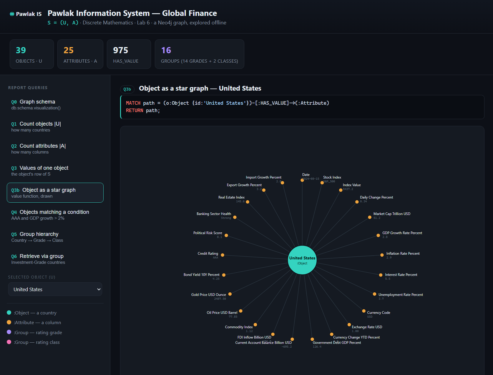
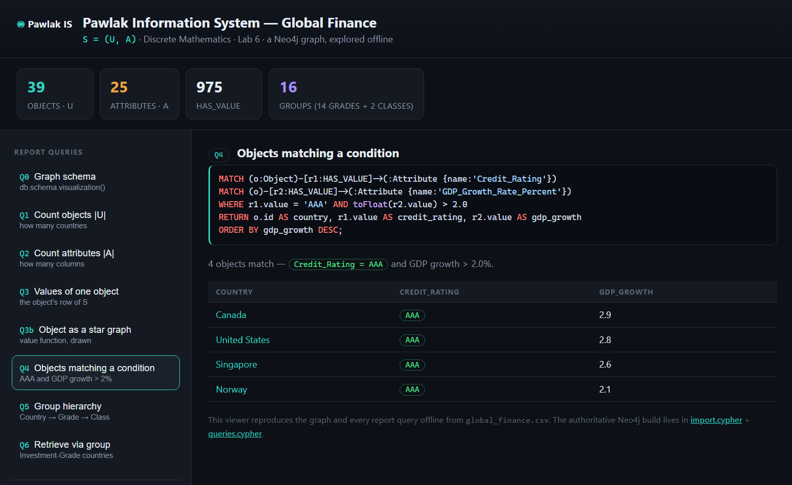
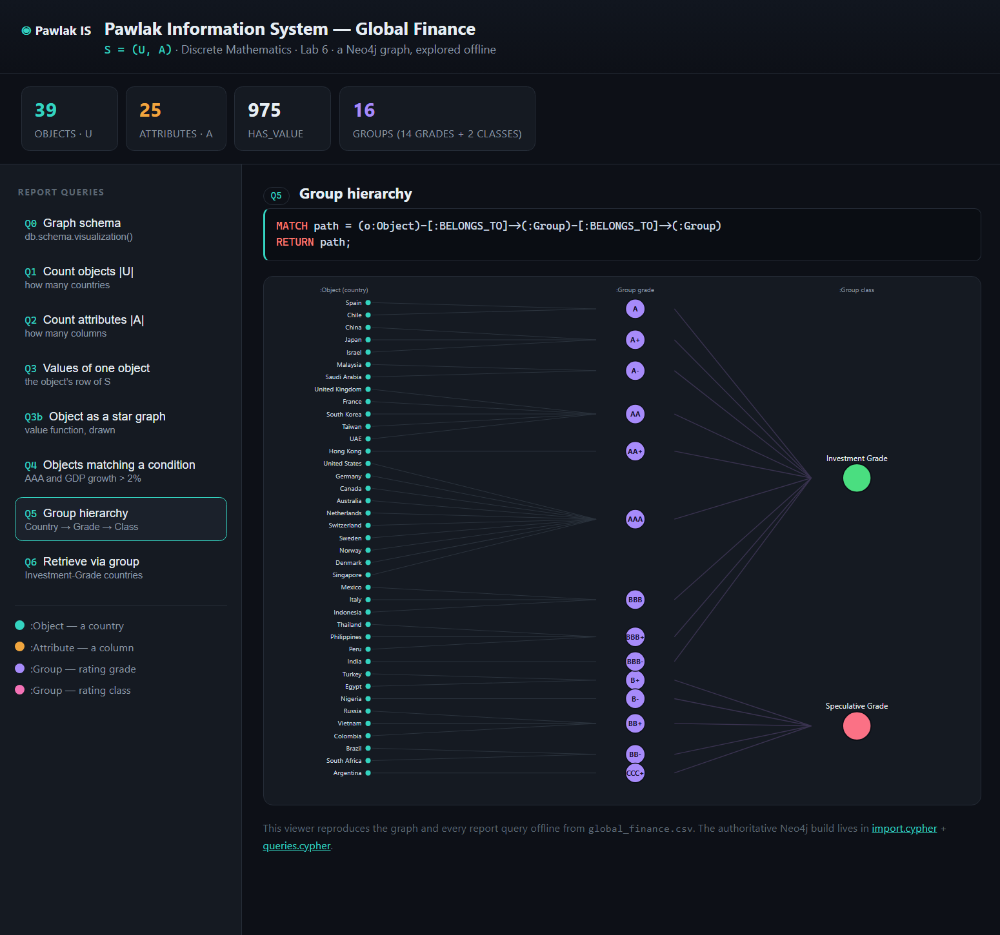

# Lab 6 — A Pawlak Information System in Neo4j

> **Aim:** model a **Pawlak Information System** `S = (U, A)` as a property graph in
> **Neo4j**, load it from a real dataset with **Cypher**, and answer a set of report
> queries — counting objects and attributes, retrieving one object's full attribute
> row, selecting objects by condition, and (optional task) building an object-group
> hierarchy and querying *through* it.

A Pawlak information system is the formal backbone of **rough-set theory**: a set of
**objects** `U`, a set of **attributes** `A`, and an information function that assigns
every object a value for every attribute. Here that maps cleanly onto a graph:

```
U = objects      →  (:Object)      one per country          (39 objects)
A = attributes   →  (:Attribute)   one per data column      (25 attributes)
ρ = value fn     →  (:Object)-[:HAS_VALUE {value}]->(:Attribute)     (975 edges)
```

The graph is **bipartite**: every value is an edge from an object to an attribute.
The dataset is [`global_finance.csv`](global_finance.csv) — 39 countries × 25 financial
indicators (stock index, GDP growth, inflation, credit rating, …).

**Optional Task 3** partitions `U` into groups by `Credit_Rating`, giving a two-level
hierarchy that Neo4j stores as more nodes and edges:

```
(:Object country) -[:BELONGS_TO]-> (:Group grade) -[:BELONGS_TO]-> (:Group class)
      Germany     ->     AAA      ->   Investment Grade
```

giving **16 Group nodes** (14 rating grades + 2 classes: *Investment* vs *Speculative*).

---

## What's in this folder

| File | Role |
|------|------|
| [`global_finance.csv`](global_finance.csv) | the dataset — 39 countries × 25 attributes (space-free, ready for `LOAD CSV`) |
| [`import.cypher`](import.cypher) | builds the whole graph: constraints, objects, attributes, `HAS_VALUE` edges, and the group hierarchy |
| [`queries.cypher`](queries.cypher) | the report queries **Q0–Q6**, each in its own block |
| [`guide.txt`](guide.txt) | step-by-step Neo4j Desktop walkthrough + the 8-screenshot checklist for the report |
| [`Discrete Math lab 6.pdf`](Discrete%20Math%20lab%206.pdf) | the assignment brief |
| [`viewer/`](viewer/) | a **self-contained offline viewer** of the same system (see below) |

> **Data note.** The dataset holds **39** countries; earlier drafts of the guide said
> 38 (and 950 `HAS_VALUE`). The numbers were corrected to **39 objects / 975 edges**
> throughout — the import logic itself was already correct (it `MERGE`s one object per row).

---

## Two ways to explore it

### 1. The real thing — Neo4j (the deliverable)

Follow [`guide.txt`](guide.txt). In short: start a local instance in **Neo4j Desktop**,
copy `global_finance.csv` into its `import` folder, then run the two scripts in the
Cypher editor:

```cypher
// paste import.cypher, Run — builds 39 Objects, 25 Attributes, 975 HAS_VALUE, 16 Groups
// then run each block of queries.cypher one at a time (each gets its own screenshot)
```

Verify:

```cypher
MATCH (o:Object)    RETURN count(o);   // 39
MATCH (a:Attribute) RETURN count(a);   // 25
```

### 2. The offline viewer (no install)

Neo4j Desktop is GUI-only, so this folder also ships a **zero-dependency viewer** that
reproduces the exact same graph and every report query from the CSV — open it and click:

```
viewer/index.html      ← double-click, runs fully offline
```

It builds `S = (U, A)` in the browser and renders each query the way Neo4j Browser would —
a graph picture or a result table — next to the **exact Cypher** that produces it.

---

## The report queries (Q0–Q6)

`queries.cypher` and the viewer stay in lock-step:

| # | Query | Result |
|---|-------|--------|
| **Q0** | `CALL db.schema.visualization()` | the schema: `Object`–`HAS_VALUE`→`Attribute`, `Object`→`Group`→`Group` |
| **Q1** | `MATCH (o:Object) RETURN count(o)` | \|U\| = **39** |
| **Q2** | `MATCH (a:Attribute) RETURN count(a)` | \|A\| = **25** |
| **Q3** | one object's `HAS_VALUE` edges | the object's full 25-attribute row |
| **Q3b** | `RETURN path` of the same | the object as a **star graph** |
| **Q4** | `Credit_Rating = 'AAA' AND GDP growth > 2.0` | the matching objects |
| **Q5** | `Object → Group → Group` | the group **hierarchy** picture |
| **Q6** | objects reaching `Investment Grade` via their grade | grouped country lists |

### Schema (Q0) — the shape of `S = (U, A)`



### One object as a star (Q3 / Q3b)

The value function drawn: a country in the centre, its 25 attribute values around it.



### Selection by condition (Q4)

Objects with a `AAA` credit rating **and** GDP growth above 2% — computed live:



### The group hierarchy (Q5, optional task)

Every country → its rating grade → its class (Investment / Speculative):



---

## Concepts, in one line each

- **Pawlak information system** — `S = (U, A)` with an information function `ρ: U × A → V`.
- **Bipartite property graph** — objects and attributes are disjoint node sets; values are the edges.
- **`LOAD CSV` + `MERGE`** — idempotent import: re-running never duplicates a node.
- **Object groups** — a partition of `U` (equivalence classes by `Credit_Rating`), the entry point to rough-set indiscernibility.

See the [root README](../README.md#lab-6--knowledge-as-a-graph-a-pawlak-information-system-in-neo4j) for how this lab fits the series.
